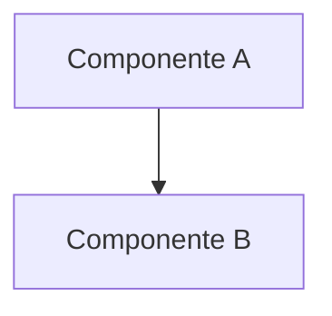

<!-- Front matter de relação: metadado que alimenta o grafo de dependências mantido
pela skill `blueprintfy` (scripts/graph_query.py). Use os nomes exatos das entradas do
CONTEXT-MAP.md em `contextos`/`afeta`. `supera` vai na ADR NOVA (a antiga é marcada
como superada pela ferramenta, não à mão). Mantenha os campos mesmo com lista vazia. -->

---
id: ADR-XXX
titulo: <título curto da decisão>
status: proposto            # proposto | aceito | superado
contextos: [<contexto/componente a que a decisão pertence>]
afeta: [<contexto(s)/componente(s) impactado(s)>]
supera: []                  # [<ADR-id>] se substitui uma decisão anterior
depende_de: []              # opcional
---

# ADR-XXX: <título curto da decisão>

- **Status**: Proposto
- **Data**: <data>
- **Autor**: <nome do líder técnico / gerado a partir do PRD>
- **PRD relacionado**: <link ou nome do PRD>

## Contexto

<Por que essa decisão precisa ser tomada agora. Cite os requisitos do PRD que
motivam isso (RF-01, RNF-02...). 2-4 frases, sem prosa desnecessária.>

## Requisitos atendidos

| ID | Requisito | Tipo |
|----|-----------|------|
| RF-01 | <descrição curta> | Funcional |
| RNF-01 | <descrição curta> | Não-funcional |

## Decisão

<Descrição objetiva da arquitetura escolhida. Inclua diagrama se houver
mais de 2 componentes envolvidos: se a skill `make-diagram` estiver
disponível, gere a imagem com ela e referencie aqui
(``); senão, use Mermaid inline.>

## Alternativas consideradas

| Alternativa | Por que não foi escolhida |
|-------------|---------------------------|
| <opção 2> | <motivo> |
| <opção 3> | <motivo> |

## Consequências

- **Positivas**: <ex.: reaproveita componente existente, reduz acoplamento>
- **Negativas / trade-offs**: <ex.: aumenta latência em X, exige nova fila>
- **Riscos**: <ex.: depende de time externo para aprovar contrato de API>

## Componentes afetados

- <componente-1>
- <componente-2>

> Atividades e Acceptance Criteria detalhadas estão em `ADR-XXX-acs.md`.