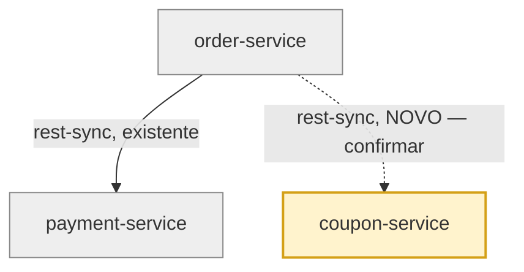

# Convenção visual — `platform-memory-graph.md`

Gerado na Fase 5.5 sempre que há componente/conexão novo a confirmar. Usa
`classDef` do Mermaid para diferenciar visualmente o que já é confirmado do
que está sendo proposto agora — assim o usuário valida a posição da nova
conexão no contexto do grafo todo, não isoladamente.

## Template



Regras:
- Componentes já em `platform-memory.yaml` com `status: confirmado` →
  classe `existente`.
- Componentes/conexões propostos nesta rodada (ainda não escritos na
  memória) → classe `novo`, e a seta usa linha tracejada (`-.->`) com o
  rótulo terminando em "NOVO — confirmar".
- Sempre desenhe o grafo **completo** (não só o trecho novo) — o ponto é
  visualizar a nova conexão no contexto de tudo que já existe, não isolada.

## Cabeçalho do arquivo gerado

```markdown
# Grafo da plataforma — proposta (ADR-XXX)

> Componentes/conexões em amarelo são novos e ainda não foram confirmados.
> Responda: o grafo está correto? A nova conexão está no lugar certo?

[diagrama mermaid aqui]
```

## Depois da confirmação (Fase 7)

Regenere o mesmo arquivo sem a classe `novo` — tudo passa a usar o estilo
`existente`, porque agora faz parte definitiva da memória. Isso evita que o
arquivo fique "preso" no estado de revisão depois que o usuário já validou.